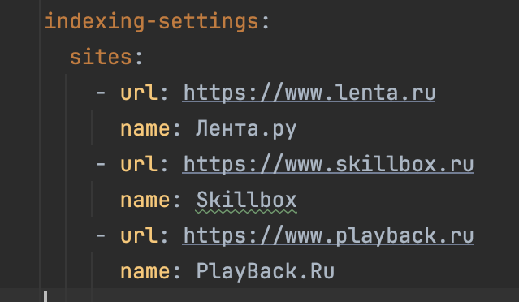
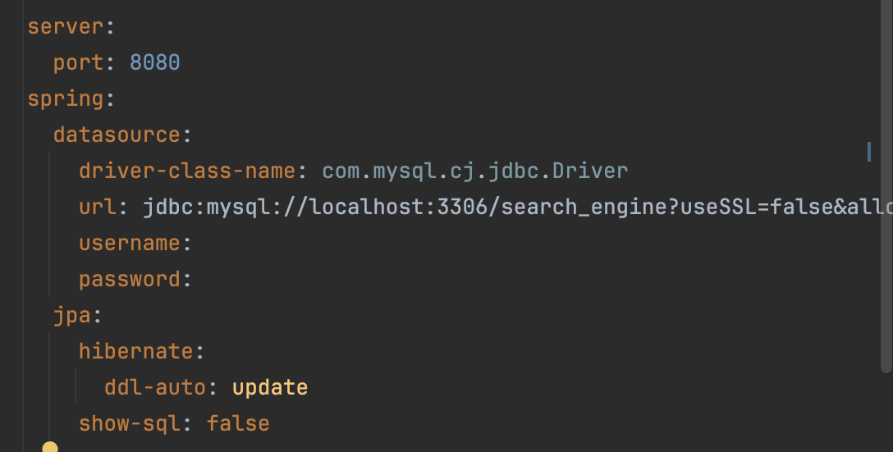
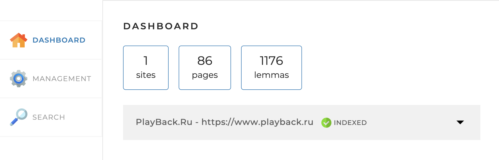
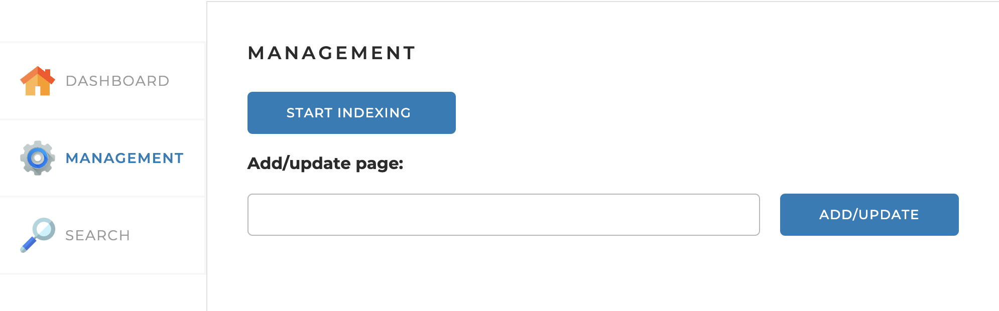
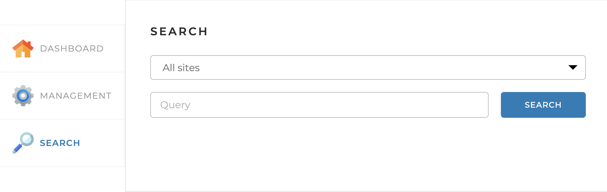

# Локальный поисковий движок Search Engine

Программный проект, использующий библиотеки для лемматизации, включает в себя набор контроллеров, сервисов и репозиториев, взаимодействующих с базой данных MySQL.

## Функции поискового движка:
- Предоставление ключевой информации о веб-сайтах.
- Проведение индексации веб-сайтов.
- Поиск заданных слов на проиндексированных веб-сайтах.
## Стек технологий:
- JPA,
- JSOUP
- Morphology Library Lucene
- SQL
- Spring Framework
- Hibernate

## Руководство
### 1. Заполнение application.yaml
 

### 2. Заполняем информацию о DB
 

### 3. Запускаем приложение

### 4. Переходим в браузере по ссылке http://localhost:8080/

#### Попадаем на вкладку Dashboard:
Эта вкладка открывается по умолчанию. На ней
отображается общая статистика по всем сайтам, а также детальная
статистика и статус по каждому из сайтов (статистика, получаемая по
запросу /api/statistics).
 

#### Management 
Вкладка Management. На этой вкладке находятся инструменты управления
поисковым движком — запуск и остановка полной индексации
(переиндексации), а также возможность добавить (обновить) отдельную
страницу по ссылке:

- START INDEXING: инициирует индексацию всех веб-сайтов, перечисленных в файле конфигурации application.yaml.
- STOP INDEXING: прекращает процесс индексации всех веб-сайтов.
- Add/update page: запускает процедуру добавления новой страницы в индекс или обновления информации о существующей странице.
 

#### Search
Вкладка Search. Эта страница предназначена для тестирования поискового
движка. На ней находится поле поиска, выпадающий список с выбором
сайта для поиска, а при нажатии на кнопку «Найти» выводятся
результаты поиска (по API-запросу /api/search):
- START SEARCHING: 

